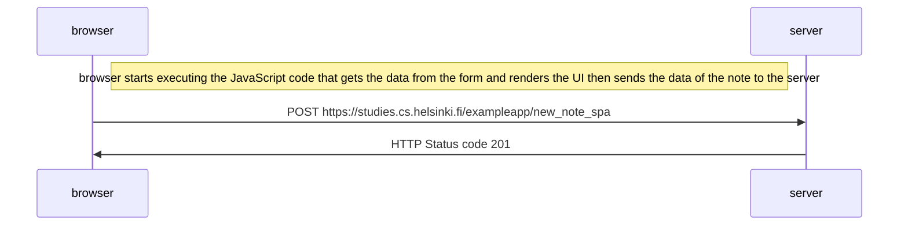

```mermaid
    sequenceDiagram
    participant browser
    participant server

    Note right of browser:  browser starts executing the JavaScript code that gets the data from the form and renders the UI then sends the data of the note to the server
    browser->>server:POST https://studies.cs.helsinki.fi/exampleapp/new_note_spa
    server->>browser: HTTP Status code 201
```
